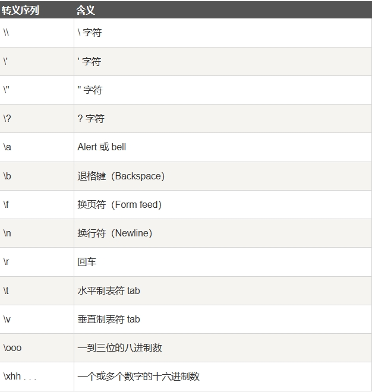

.NET dot net

c# 标识符可以有数字、字母、下划线、@ ，不能以数字开头

```csharp
using System;
namespace RectangleApplication
{
    class Rectangle
    {
        // 成员变量
        double length;
        double width;
        public void Acceptdetails()
        {
            length = 4.5;
            width = 3.5;
        }
        public double GetArea()
        {
            return length * width;
        }
        public void Display()
        {
            Console.WriteLine("Length: {0}", length);
            Console.WriteLine("Width : {0}", width);
            Console.WriteLine("Area: {0}", GetArea());
        }
    }
    class ExecuteRectangle
    {
        static void Main(string[] args)
        {
            Rectangle r = new Rectangle();
            r.Acceptdetails();
            r.Display();
            Console.ReadLine();
        }
        /* 这是多行

        注释*/
        // 这是一行注释
    }
}
```

下面列举 c# 2010 中可用的值的类型 :

bool 布尔值 True or False 默认 False

byte 8位无符号整数 0~255 默认 0

char 16位 Unicode字符 U +0000 到 U +ffff 默认'\0'

decimal 128位精确的十进制值，28~29有效位数 ()

sbyte 

short

uint

ulong

ushort

CTS : Common Type System c# 通用类型系统

`Object` 类型是 CTS 中所有数据类型的终极基类。`Object` 是 `System.Object` 类的别名。

所有对象类型可以被分配任何其他类型（值类型、引用类型、预定义类型或用户自定义类型）的值。但是，在分配值之前，需要先进行类型转换。

---

当一个值类型转换为 `Object` 时，称为**装箱** ；当一个 `Object` 转化为值类型时，称为**拆箱**

# C# 学习笔记

## c# 数据类型

###### 对象（Object）类型

**对象（Object）类型** 是 C# 通用类型系统（Common Type System - CTS）中所有数据类型的终极基类。Object 是 System.Object 类的别名。所以对象（Object）类型可以被分配任何其他类型（值类型、引用类型、预定义类型或用户自定义类型）的值。但是，在分配值之前，需要先进行类型转换。

当一个值类型转换为对象类型时，则被称为 **装箱**；另一方面，当一个对象类型转换为值类型时，则被称为 **拆箱**。

```csharp
object obj;
obj = 100; // 这是装箱
```

###### 动态（Dynamic）类型

您可以存储任何类型的值在动态数据类型变量中。这些变量的类型检查是在运行时发生的。

声明动态类型的语法：

```csharp
dynamic <variable_name> = value;
```

例如  ：

```csharp
dynamic d = 20;
```

动态类型与对象类型相似，但是对象类型变量的类型检查是在编译时发生的，而动态类型变量的类型检查是在运行时发生的。

### 字符串（String）类型

**字符串（String）类型** 允许您给变量分配任何字符串值。字符串（String）类型是 System.String 类的别名。它是从对象（Object）类型派生的。字符串（String）类型的值可以通过两种形式进行分配：引号和 @引号。

例如 :

```csharp
String str = "runoob.com";
```

一个 @ 引号字符串 :

```csharp
@"runoob.com"
```

C# string 字符串的前面可以加 @（称作"逐字字符串"）将转义字符（\）当作普通字符对待，比如：

```csharp
string str = @"C:\Windows";
```

等价于 :

```csharp
string str = "C:\\Windows";
```

@ 字符串中可以任意换行，换行符及缩进空格都计算在字符串长度之内。

```csharp
string str = @"<script type=""text/javascript"">
    <!--
    -->
</script>";
```

用户自定义引用类型有：class、interface 或 delegate。我们将在以后的章节中讨论这些类型。

### 指针类型（Pointer types）

指针类型变量存储另一种类型的内存地址。C# 中的指针与 C 或 C++ 中的指针有相同的功能。

声明指针类型的语法：

```csharp
type* identifier;
```

例如 :

```csharp
char* cptr;
int* iptr;
```

## C# 类型转换

在 C# 中，类型转换是将一个数据类型的值转换为另一个数据类型的过程。

C# 中的类型转换可以分为两种：隐式类型转换和显式类型转换（也称为强制类型转换）。

### 隐式类型转换

隐式转换是指将一个较小范围的数据类型转换为较大范围的数据类型时，编译器会自动完成类型转换，这些转换是 C# 默认的以安全方式进行的转换, 不会导致数据丢失。

例如，从小的整数类型转换为大的整数类型，从派生类转换为基类。将一个 byte 类型的变量赋值给 int 类型的变量，编译器会自动将 byte 类型转换为 int 类型，不需要显示转换。

```csharp
byte b = 10;
int i = b; // 隐式转换，不需要显式转换
```

将一个整数赋值给一个长整数，或者将一个浮点数赋值给一个双精度浮点数，这种转换不会导致数据丢失：

```csharp
int intValue = 42;
long longValue = intValue;
```

### 显式转换

显式类型转换，即强制类型转换。

显式转换是指将一个较大范围的数据类型转换为较小范围的数据类型时，或者将一个对象类型转换为另一个对象类型时，需要使用强制类型转换符号进行显示转换，强制转换会造成数据丢失。

例如，将一个 int 类型的变量赋值给 byte 类型的变量，需要显示转换。

```csharp
int i = 10;
byte b = (byte)i; // 显式转换，需要使用强制类型转换符号
```

强制转换为浮点数类型：

```csharp
int intValue = 42;
float floatValue = (float)intValue; // 强制从 int 到 float，数据可能损失精度
```

强制转换为字符串类型:

```csharp
int intValue = 123;
string stringValue = intValue.Tostring();
```

下面的实例显示了一个显式的类型转换：

```cpp
using System;
namespace TypeConversionApplication
{
    class ExplicitConversion
    {
        static void Main(string[] args)
        {
            double d = 5673.43;
            int i;

            // 强制转换 double 为 int
            i = (int)d;
            Console.WriteLine(i);
            Console.ReadKey();
        }
    }
}
```

当上面的代码被编译和执行时，它会产生下列结果：

```php
5673
```

### C# 类型转换方法

C# 提供了下列内置的类型转换方法：

[C# 类型转换 | 菜鸟教程 (runoob.com)](https://www.runoob.com/csharp/csharp-type-conversion.html)


下面的实例把不同值的类型转换为字符串类型：

```cpp
using System;
namespace TypeConversionApplication
{
    class StringConvsersion
    {
        static void Main(string[] args)
        {
            int i = 75;
            float f = 53.005f;
            double d = 2345.7652;
            bool b = true;

            Console.WriteLine(i.ToString());
            Console.WriteLine(f.ToString());
            Console.WriteLine(d.ToString());
            Console.WriteLine(b.ToString());
        }
    }
}
```

当上面的代码被编译和执行时，它会产生下列结果：

```php
75
53.005
2345.7652
True
```

在进行类型转换时需要注意以下几点：

- 隐式转换只能将较小范围的数据类型转换为较大范围的数据类型，不能将较大范围的数据类型转换为较小范围的数据类型；
- 显式转换可能会导致数据丢失或精度降低，需要进行数据类型的兼容性检查；
- 对于对象类型的转换，需要进行类型转换的兼容性检查和类型转换的安全性检查。

## C# 变量

一个变量不过是一个供程序操作的存储区的名字。

在 C# 中，变量是用于存储和表示数据的标识符，在声明变量时，您需要指定变量的类型，并且可以选择性地为其分配一个初始值。

在 C# 中，每个变量都有一个特定的类型，类型决定了变量的内存大小和布局，范围内的值可以存储在内存中，可以对变量进行一系列操作。

我们已经讨论了各种数据类型。C# 中提供的基本的值类型大致可以分为以下几类：


C# 允许定义其他值类型的变量，比如 **enum**，也允许定义引用类型变量，比如 **class**。

C# 4.0引入了动态类型 (dynamic)，它允许在运行时推断变量的类型。这在一些特殊情况下很有用，但通常最好使用静态类型以获得更好的性能和编译时类型检查。

```csharp
dynamic dynamicVariable = "This can be any type";
```

### C# 中的变量定义

C# 中变量定义的方法 :

```csharp
<data_type> <variable_list>
```

在这里，data_type 必须是一个有效的 C# 数据类型，可以是 char、int、float、double 或其他用户自定义的数据类型。variable_list 可以由一个或多个用逗号分隔的标识符名称组成。

一些有效的变量定义如下所示：

```csharp
int i, j, k;
char c, ch;
float f, salary;
double d;
```

变量可以在声明时被初始化（指定一个初始值）。初始化由一个等号后跟一个常量表达式组成，如下所示：

```csharp
int d = 3, f = 5;
byte z = 22;
double pi = 3.14159;
char x = 'x';
```

请看下面的实例，使用了各种类型的变量：

```csharp
using System;
namespace VariableDefinition
{
    class Program
    {
        static void Main(string[] args)
        {
            short a;
            int b;
            float c;

            a = 10;
            b = 20;
            c = a + b;

            Console.WriteLine("a = {0}, b = {1}, c = {2}", a, b, c);
            Console.ReadLine();
        }
    }
}
```

```php
a = 10, b = 20, c = 30
```

### 变量的命名规范

在 C# 中，变量的命名需要遵循一些规则：

- 变量名可以包含字母、数字和下划线。
- 变量名必须以字母或下划线开头。
- 变量名区分大小写。
- 避免使用 C# 的关键字作为变量名。

```csharp
int myVariable = 10;
string _userName = "John";
```

### 接受来自用户的值

**System** 命名空间中的 **Console** 类提供了一个函数 **ReadLine()**，用于接收来自用户的输入，并把它存储到一个变量中。

例如：

```csharp
int num;
num = Convert.ToInt32(Console.ReadLine());
```

## C# 变量作用域

在 C# 中，变量的作用域定义了变量的可见性和生命周期。

变量的作用域通常由花括号 {} 定义的代码块来确定。

以下是关于C#变量作用域的一些基本规则：

### 局部变量

在方法、循环、条件语句等代码块内声明的变量是局部变量，它们只在声明它们的代码块中可见。

```csharp
void MyMethod(){
    int localvar = 10; // 局部变量
    // ...
}
// localVar 在这里不可见
```

### 块级作用域

在 C# 7及更高版本中，引入了块级作用域，即使用大括号 {} 创建的任何块都可以定义变量的作用域。

```csharp
{
    int blockVar = 20; // 块级作用域
    // ...
}
// blockVar 在这里不可见
```

### 方法参数作用域

方法的参数也有其自己的作用域，它们在整个方法中都是可见的。

```csharp
void MyMethod(int parameter)
{
    // parameter 在整个方法中可见
    // ...
}
```

### 全局变量

在类的成员级别定义的变量是成员变量，它们在整个类中可见，如果在命名空间级别定义，那么它们在整个命名空间中可见。

```csharp
class MyClass
{
    int memberVar = 30; // 成员变量，在整个类中可见
}
```

### 静态变量作用域

静态变量是在类级别上声明的，但它们的作用域也受限于其定义的类。

```csharp
class MyClass
{
    static int staticVar = 40; // 静态变量，在整个类中可见
}
```

### 循环变量作用域

在 for 循环中声明的循环变量在循环体内可见。

```csharp
for (int i = 0; i < 5; i++)
{
    // i 在循环体内可见
}
// i 在这里不可见
```

总体而言，变量的作用域有助于管理变量的可见性和生命周期，确保变量在其有效范围内使用，也有助于防止命名冲突。

# C# 常量

常量是固定值，程序执行期间不会改变。常量可以是任何基本数据类型，比如整数常量、浮点常量、字符常量或者字符串常量，还有枚举常量。

常量可以被当作常规的变量，只是它们的值在定义后不能被修改。

## 整数常量

整数常量可以是十进制、八进制或十六进制的常量。前缀指定基数：0x 或 0X 表示十六进制，0 表示八进制，没有前缀则表示十进制。

整数常量也可以有后缀，可以是 U 和 L 的组合，其中，U 和 L 分别表示 unsigned 和 long。后缀可以是大写或者小写，多个后缀以任意顺序进行组合。

这里有一些整数常量的实例：

```php
212         /* 合法 */
215u        /* 合法 */
0xFeeL      /* 合法 */
078         /* 非法：8 不是一个八进制数字 */
032UU       /* 非法：不能重复后缀 */
```

以下是各种类型的整数常量的实例：

```php
85         /* 十进制 */
0213       /* 八进制 */
0x4b       /* 十六进制 */
30         /* int */
30u        /* 无符号 int */
30l        /* long */
30ul       /* 无符号 long */
```

## 浮点常量

一个浮点常量是由整数部分、小数点、小数部分和指数部分组成。您可以使用小数形式或者指数形式来表示浮点常量。

这里有一些浮点常量的实例：

```php
3.14159       /* 合法 */
314159E-5L    /* 合法 */
510E          /* 非法：不完全指数 */
210f          /* 非法：没有小数或指数 */
.e55          /* 非法：缺少整数或小数 */
```

使用浮点形式表示时，必须包含小数点、指数或同时包含两者。使用指数形式表示时，必须包含整数部分、小数部分或同时包含两者。有符号的指数是用 e 或 E 表示的。

## 字符常量

字符常量是括在单引号里，例如，'x'，且可存储在一个简单的字符类型变量中。一个字符常量可以是一个普通字符（例如 'x'）、一个转义序列（例如 '\t'）或者一个通用字符（例如 '\u02C0'）。

在 C# 中有一些特定的字符，当它们的前面带有反斜杠时有特殊的意义，可用于表示换行符（\n）或制表符 tab（\t）。在这里，列出一些转义序列码：



```csharp
namespace EscapeChar
{
    class Program
    {
        static void Main(string[] args)
        {
            Console.WriteLine("Hello\tWorld\n\n");
            Console.ReadLine();
        }
    }
}
```

```php
Hello   World
```

## 字符串常量

字符串常量是括在双引号 "" 里，或者是括在 @"" 里。字符串常量包含的字符与字符常量相似，可以是：普通字符、转义序列和通用字符

使用字符串常量时，可以把一个很长的行拆成多个行，可以使用空格分隔各个部分。

这里是一些字符串常量的实例。下面所列的各种形式表示相同的字符串。

```csharp
string a = "hello, world";                  // hello, world
string b = @"hello, world";               // hello, world
string c = "hello \t world";               // hello     world
string d = @"hello \t world";               // hello \t world
string e = "Joe said \"Hello\" to me";      // Joe said "Hello" to me
string f = @"Joe said ""Hello"" to me";   // Joe said "Hello" to me
string g = "\\\\server\\share\\file.txt";   // \\server\share\file.txt
string h = @"\\server\share\file.txt";      // \\server\share\file.txt
string i = "one\r\ntwo\r\nthree";
string j = @"one
two
three";
```

## 定义常量

常量是使用 **const** 关键字来定义的 。定义一个常量的语法如下：

```csharp
const <data_type> <constant_name> = value;
```

下面的代码演示了如何在程序中定义和使用常量：

```csharp
using System;

public class ConstTest
{
    class SampleClass
    {
        public int x;
        public int y;
        public const int c1 = 5;
        public const int c2 = c1 + 5;

        public SampleClass(int p1, int p2)
        {
            x = p1;
            y = p2;
        }
    }

    static void Main()
    {
        SampleClass mC = new SampleClass(11, 22);
        Console.WriteLine("x = {0}, y = {1}", mC.x, mC.y);
        Console.WriteLine("c1 = {0}, c2 = {1}", SampleClass.c1, SampleClass.c2);
    }
}
```

```php
x = 11, y = 22
c1 = 5, c2 = 10
```

[C# 常量 | 菜鸟教程 (runoob.com)](https://www.runoob.com/csharp/csharp-constants.html)
